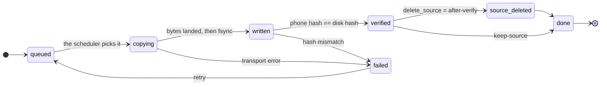

<div align="center">

# portage

**Get a phone's downloads onto an archive drive — fast, verified, and safe to interrupt.**

[](https://bun.sh)
[](https://www.typescriptlang.org/)
[](#build-and-develop)
[](#what-it-does-not-do)

<sub>
<a href="#the-contract">The contract</a> ·
<a href="#quickstart">Quickstart</a> ·
<a href="#why-it-is-fast">Why it's fast</a> ·
<a href="#commands">Commands</a> ·
<a href="#install">Install</a> ·
<a href="#build-and-develop">Build</a>
</sub>

</div>

The MTP mount Android gives you takes **9 to 27 minutes** for an 8 GB season and
fails halfway through. Portage does it in about **3**, resumes if the cable comes
out, checks every byte before it touches anything on the phone, and tells you
which episodes you already have before it copies a single one.

## Quickstart

```bash
portage doctor     # is everything plugged in and ready?
portage plan       # what would move, and what can be skipped
portage pull       # move it — verified, then deleted from the phone
portage status     # what moved, what failed, what's still on the phone
```

## The contract

**Nothing is deleted from your phone until the copy on the drive has been
proven byte-for-byte identical.**

That is not a bullet point, it is enforced in code: the tool refuses to call a
file `verified` without a matching `sha256` from the phone itself compared
against the file on disk, and deletion is a separate step that only ever runs on
a file that was just transferred and just verified.

This is the failure mode the tool exists to prevent, and it is easy to reach by
accident:

```bash
rsync -a --remove-source-files   # exits 0, deletes the source,
                                 # leaves a corrupt file behind
```

A destination that is corrupt but has the right size and the right mtime looks
up to date. rsync skips it, then deletes the only good copy. No warning, no
non-zero exit, nothing left to detect afterwards.

Portage never passes that flag. It copies, hashes both sides, compares, and only
then deletes — as its own step, on its own terms.

## The life of a file

Every file walks this machine, and it only ever moves forwards. `verified` is the
gate: nothing crosses it without a hash from the phone matching the bytes on
disk.



A `failed` file keeps its partial in `.portage/partial/`, never in your archive
tree — so nothing half-written ever looks like a real episode.

## Why it is fast

The bottleneck was never the code, it was the transport. Measured on real
hardware:

| Path                          | Speed         | 8 GB season           |
| ----------------------------- | ------------- | --------------------- |
| MTP mount (what you have now) | 5–15 MB/s     | 9–27 min, often fails |
| **`adb pull`**                | **35.5 MB/s** | **~4 min**            |
| `adb pull`, ×3 concurrent     | **40.8 MB/s** | **~3.3 min**          |

`adb` talks to Android's own filesystem directly, which removes the translation
layer MTP puts in the way. No app on the phone, no Termux, no SSH server — just
the `adb` you already have for debugging.

It also reports 35 MB/s before the bytes are actually on the platters. About a
quarter of a transfer's wall time is writeback it has already called finished,
so Portage flushes before it claims a file is done, and reports the honest rate
rather than adb's flattering one.

## It knows what you already have

The most expensive mistake in this workflow is copying 6.8 GB you already have.
On the first real run, a season on the phone was **17 of 23 episodes already on
the drive** — the right job was 6 files, not 23.

`portage plan` shows you that before anything moves:

```
plan
  destination:       /media/you/2TB/Videos/$Anime
  to transfer:       6 files · 2.4 GB
  already have:      17 files · 6.8 GB
```

## When something goes wrong

```
$ portage pull
→ [SubsPlease] Frieren - 13 (1080p) [A1B2C3D4].mkv
x cable pulled mid-transfer

$ portage status
failed  412 MB  /sdcard/Movies/Frieren/S01/ep13.mkv   adb pull exited 1

$ portage pull        # picks up where it stopped
```

Partial files live in `.portage/partial/` on the drive's own filesystem, never
in your archive tree — so nothing half-written ever looks like a real episode. A
journal at `<drive>/.portage/portage.db` records every device, file, hash and
run, and it travels with the drive, so "what did I move, and when?" is answered
by any machine you plug the drive into.

## Keep it on the phone for now

Not every file should disappear the moment it lands.

```bash
portage pull --keep-source   # copy and verify, leave the phone alone
portage status               # verified on the drive, still on the phone
portage purge                # delete them from the phone, whenever you want
```

`purge` will not remove a phone file unless its content is provably on the
drive — the stored hash, or a fresh comparison when you pass `--verify-hash` to
recompute both sides now. Files it cannot prove are listed with the reason
rather than skipped silently.

## Commands

Working today:

| Command   |                                                                                |
| --------- | ------------------------------------------------------------------------------ |
| `doctor`  | environment, device, link speed and drive report, with a fix for every problem |
| `devices` | attached devices and the id used in your config                                |
| `scan`    | every file on the phone with a verdict and the reason for it                   |
| `plan`    | exactly what `pull` would move, and what it would skip                         |
| `pull`    | verified transfer, deletion only after proof                                   |
| `status`  | runs, per-file state, and what is verified but still on the phone              |
| `purge`   | deferred deletion, provable only                                               |
| `config`  | read and write config, plus the precedence chain that resolved it              |
| `db`      | journal info, vacuum, JSONL export                                             |

### Global flags

| Flag                  | What it does                                          |
| --------------------- | ----------------------------------------------------- |
| `--json`              | machine-readable output; every command supports it    |
| `--plain`             | no colour, no cursor control — the default when piped |
| `--verbose`           | debug logging on stderr                               |
| `--quiet`             | errors only                                           |
| `--config <path>`     | use a different config file                           |
| `--dest-root <path>`  | override the destination for this run                 |
| `--version`, `--help` | the usual                                             |

### For `pull`, `plan` and `scan`

| Flag              | What it does                                                     |
| ----------------- | ---------------------------------------------------------------- |
| `--device <id>`   | restrict to one device — its id, serial, or a model substring    |
| `--show <text>`   | only files whose path contains `<text>`                          |
| `--since 7d`      | only files modified inside the window (`36h`, `7d`, `900s`)      |
| `--jobs N`        | concurrent transfers (default `3`; drops to `1` on a USB 2 link) |
| `--dry-run`       | show what would happen and change nothing                        |
| `--keep-source`   | copy and verify, never delete the phone copy                     |
| `--delete-source` | copy, then delete **after** verification                         |

### For `purge`

| Flag            | What it does                                                 |
| --------------- | ------------------------------------------------------------ |
| `--dry-run`     | list what would go; delete nothing                           |
| `--verify-hash` | recompute both hashes now instead of trusting the stored one |

### Exit codes

Scripts branch on these, so they are part of the interface:

| Code | Meaning              |
| ---- | -------------------- |
| `0`  | success              |
| `1`  | usage or config      |
| `2`  | precondition failed  |
| `3`  | transfer error       |
| `4`  | verification failure |
| `5`  | interrupted          |

## Roadmap

Built and in design, not yet implemented — the plan is in the git history:

- **Duplicate detection.** Byte-identical and same-episode-different-release
  reports across all archive roots, with per-item deletion into a recoverable
  trash. Both tiers report-only; there is no `--yes` for deletion at either
  tier, by design.
- **A live terminal dashboard** for `pull`, behind a renderer interface so every
  action stays available as `--plain` and `--json`.
- **`--organize`**, opt-in, previewed before it acts, and it never guesses a
  season number.
- **`verify --deep`** and **`retry`** as first-class commands.

## Install

Requires [Bun](https://bun.sh) ≥ 1.2 and `adb` from the Android platform-tools.
Nothing gets installed on the phone.

```bash
git clone https://github.com/Michael-Obele/portage
cd portage
bun install
bun run build
install -Dm755 dist/portage ~/.local/bin/portage
```

Then tell it where the drive is:

```bash
portage config set dest_root '/media/you/2TB/Videos/$Anime'
portage config set jobs 3
```

Per-device folders go in the drive's own config, so they travel with it:

```toml
# <drive>/.portage/config.toml
dest_root     = "/media/you/2TB/Videos/$Anime"
quiet_seconds = 120
jobs          = 3
delete_source = "after-verify"    # after-verify | never | prompt

[devices."<sha1-of-serial>"]
label = "Pixel 10 Pro XL"
roots = ["/sdcard/Movies", "/sdcard/Download/Anime"]
```

The device key is `sha1(ro.serialno)`, not the serial number — `portage devices`
prints it. Configuration resolves in this order: flags beat `PORTAGE_*` env
variables, which beat the drive's config, which beats your user config, which
beats the defaults. `portage config` shows you where every value came from.

## Every command works without a terminal

```bash
portage pull --json | jq '.files_done, .bytes'
portage plan --json | jq -r '.skipped[].from'
```

`--plain` gives clean uncoloured text; piping without either gives you that
automatically. Nothing about the transfer engine depends on a terminal being
attached.

## What it does not do

Being straight about the edges, because a tool that hides them costs you an
afternoon:

- **It is not a backup.** One USB drive has no redundancy. This moves files off
  a phone and tells you where they went; it does not protect you from the drive
  dying.
- **No background daemon.** You run it. "Plug in a phone and it just starts"
  cannot be made safe without a notification story nobody has built yet.
- **No metadata lookups, no auto-renaming.** Your folder layout is preserved
  exactly, always.
- **Absolute anime numbering is not mapped.** `- 25` is often S02E01. Mapping
  that needs per-show episode counts from a metadata source, and a wrong guess
  would merge two different episodes — so it stays in the backlog, not the
  code.
- **Local drive only.** A network destination needs a different durability
  story.
- **Linux and macOS only**, because it is built on `adb` and `find`.

## Build and develop

Everything runs on Bun. There is no `npm` step and no tooling beyond `bun` itself.

| Command                 | What it does                                   |
| ----------------------- | ---------------------------------------------- |
| `bun install`           | install dependencies                           |
| `bun test`              | 48 tests — no phone, no drive, no `adb` needed |
| `bun run typecheck`     | `tsc --noEmit`                                 |
| `bun run build`         | compile a single binary to `dist/portage`      |
| `bun run dev`           | run the CLI with `--watch`                     |
| `bun run doctor`        | shorthand for `portage doctor`                 |
| `./scripts/rehearse.sh` | the whole pipeline against a fake device       |

```bash
bun install
bun test
bun run build
install -Dm755 dist/portage ~/.local/bin/portage
```

The tests are built around deliberately broken fixtures — a transport that dies
mid-file, one that exits 0 having written corrupt bytes, a device whose hash
disagrees with the disk. A fake that only ever succeeds would prove nothing about
a tool whose job is not deleting your files.
