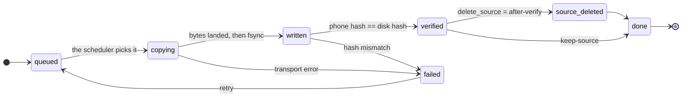

<div align="center">

# portage

**Get your phone's downloads onto an archive drive. Every copy is checked before anything is deleted, and you can stop at any time.**

[](https://bun.sh)
[](https://www.typescriptlang.org/)
[](#build-and-develop)
[](#what-it-does-not-do)

<sub>
<a href="#the-contract">The contract</a> ·
<a href="#quickstart">Quickstart</a> ·
<a href="#why-it-is-fast">Why it's fast</a> ·
<a href="#commands">Commands</a> ·
<a href="#install">Install</a> ·
<a href="#build-and-develop">Build</a>
</sub>

</div>

The MTP mount that Android gives you takes **9 to 27 minutes** to move an 8 GB
season, and it often fails halfway through. Portage takes about **3 minutes**. If
the cable comes out, it resumes. It checks every byte before it changes anything
on the phone, and it tells you which episodes you already have before it copies
one.

## Quickstart

```bash
portage doctor     # is everything plugged in and ready?
portage plan       # what would move, and what can be skipped
portage pull       # move it, and delete the phone copy only after a check
portage status     # what moved, what failed, what's still on the phone
```

## The contract

**Nothing is deleted from your phone until the copy on the drive has been
proven byte-for-byte identical.**

This is enforced in code: the tool refuses to call a file `verified` unless a
`sha256` from the phone matches the file on disk. Deletion is a separate step,
and it only runs on a file that was just transferred and just verified.

This failure is easy to cause by accident, and it is the reason the tool exists:

```bash
rsync -a --remove-source-files   # exits 0, deletes the source,
                                 # leaves a corrupt file behind
```

A corrupt file on the drive can still have the right size and the right mtime, so
it looks up to date. rsync skips it, then deletes the only good copy. There is no
warning and no non-zero exit code, so nothing tells you that it happened.

Portage never passes that flag. It copies the file, hashes both sides, compares
them, and only then deletes the phone copy, as a separate step.

## What happens to a file

Every file goes through the same steps, and it never moves backwards. `verified`
is the gate: a file does not pass it unless a hash from the phone matches the
bytes on disk.



A `failed` file keeps its partial data in `.portage/partial/`, not in your archive
tree, so a half-written file never looks like a real episode.

## Why it is fast

The slow part is the transport, not the code. These numbers are from real
hardware:

| Path                          | Speed         | 8 GB season              |
| ----------------------------- | ------------- | ------------------------ |
| MTP mount (what you have now) | 5 to 15 MB/s  | 9 to 27 min, often fails |
| **`adb pull`**                | **35.5 MB/s** | **~4 min**               |
| `adb pull`, ×3 concurrent     | **40.8 MB/s** | **~3.3 min**             |

`adb` talks to Android's filesystem directly, so it skips the translation layer
that MTP adds. There is no app to install on the phone, no Termux, and no SSH
server. It uses the `adb` you already have for debugging.

adb also reports 35 MB/s before the bytes are actually written to the disk. About
a quarter of a transfer's time is writeback that adb has already counted as done,
so Portage flushes each file before it calls it finished, and reports the real
rate instead of adb's number.

## It knows what you already have

The most expensive mistake here is copying files you already have. On my first
real run, **17 of the 23 episodes** in a season were already on the drive. That
was 6.8 GB I did not need to copy, so the real job was 6 files, not 23.

`portage plan` shows you that before anything moves:

```
plan
  destination:       /media/you/2TB/Videos/$Anime
  to transfer:       6 files · 2.4 GB
  already have:      17 files · 6.8 GB
```

## When something goes wrong

```
$ portage pull
→ [SubsPlease] Frieren - 13 (1080p) [A1B2C3D4].mkv
x cable pulled mid-transfer

$ portage status
failed  412 MB  /sdcard/Movies/Frieren/S01/ep13.mkv   adb pull exited 1

$ portage pull        # picks up where it stopped
```

Partial files live in `.portage/partial/` on the drive itself, so they never mix
with your archive. A journal at `<drive>/.portage/portage.db` records every
device, file, hash, and run. The journal travels with the drive, so any machine
you plug it into can answer "what did I move, and when?"

## Keep it on the phone for now

Not every file should disappear the moment it lands.

```bash
portage pull --keep-source   # copy and verify, leave the phone alone
portage status               # verified on the drive, still on the phone
portage purge                # delete them from the phone, whenever you want
```

`purge` will not remove a phone file unless it can prove the same content is on
the drive. It checks the stored hash, or does a fresh comparison when you pass
`--verify-hash` to recompute both sides. Files it cannot prove are listed with the
reason, not skipped silently.

## Commands

Working today:

| Command   |                                                                                |
| --------- | ------------------------------------------------------------------------------ |
| `doctor`  | environment, device, link speed and drive report, with a fix for every problem |
| `devices` | attached devices and the id used in your config                                |
| `scan`    | every file on the phone with a verdict and the reason for it                   |
| `plan`    | exactly what `pull` would move, and what it would skip                         |
| `pull`    | verified transfer, deletion only after proof                                   |
| `status`  | runs, per-file state, and what is verified but still on the phone              |
| `purge`   | deletes the phone copy later, only after proof                                 |
| `config`  | read and write config, plus the precedence chain that resolved it              |
| `db`      | journal info, vacuum, JSONL export                                             |

### Global flags

| Flag                  | What it does                                         |
| --------------------- | ---------------------------------------------------- |
| `--json`              | machine-readable output; every command supports it   |
| `--plain`             | no colour, no cursor control; the default when piped |
| `--verbose`           | debug logging on stderr                              |
| `--quiet`             | errors only                                          |
| `--config <path>`     | use a different config file                          |
| `--dest-root <path>`  | override the destination for this run                |
| `--version`, `--help` | the usual                                            |

### For `pull`, `plan` and `scan`

| Flag              | What it does                                                     |
| ----------------- | ---------------------------------------------------------------- |
| `--device <id>`   | restrict to one device: its id, serial, or part of a model name  |
| `--show <text>`   | only files whose path contains `<text>`                          |
| `--since 7d`      | only files modified inside the window (`36h`, `7d`, `900s`)      |
| `--jobs N`        | concurrent transfers (default `3`; drops to `1` on a USB 2 link) |
| `--dry-run`       | show what would happen and change nothing                        |
| `--keep-source`   | copy and verify, never delete the phone copy                     |
| `--delete-source` | copy, then delete **after** verification                         |

### For `purge`

| Flag            | What it does                                                 |
| --------------- | ------------------------------------------------------------ |
| `--dry-run`     | list what would go; delete nothing                           |
| `--verify-hash` | recompute both hashes now instead of trusting the stored one |

### Exit codes

Scripts branch on these, so they are part of the interface:

| Code | Meaning              |
| ---- | -------------------- |
| `0`  | success              |
| `1`  | usage or config      |
| `2`  | precondition failed  |
| `3`  | transfer error       |
| `4`  | verification failure |
| `5`  | interrupted          |

## Roadmap

These are designed but not built yet. The plan is in the git history:

- **Duplicate detection.** Byte-identical and same-episode-different-release
  reports across all archive roots, with per-item deletion into a recoverable
  trash. Both tiers report-only; there is no `--yes` for deletion at either
  tier, by design.
- **A live terminal dashboard** for `pull`, behind a renderer interface so every
  action stays available as `--plain` and `--json`.
- **`--organize`**, opt-in, previewed before it acts, and it never guesses a
  season number.
- **`verify --deep`** and **`retry`** as first-class commands.

## Install

Requires [Bun](https://bun.sh) ≥ 1.2 and `adb` from the Android platform-tools.
Nothing gets installed on the phone.

```bash
git clone https://github.com/Michael-Obele/portage
cd portage
bun install
bun run build
install -Dm755 dist/portage ~/.local/bin/portage
```

Then tell it where the drive is:

```bash
portage config set dest_root '/media/you/2TB/Videos/$Anime'
portage config set jobs 3
```

Per-device folders go in the drive's own config, so they travel with it:

```toml
# <drive>/.portage/config.toml
dest_root     = "/media/you/2TB/Videos/$Anime"
quiet_seconds = 120
jobs          = 3
delete_source = "after-verify"    # after-verify | never | prompt

[devices."<sha1-of-serial>"]
label = "Pixel 10 Pro XL"
roots = ["/sdcard/Movies", "/sdcard/Download/Anime"]
```

The device key is `sha1(ro.serialno)`, not the serial number. `portage devices`
prints it. Configuration resolves in this order: flags first, then `PORTAGE_*`
environment variables, then the drive's config, then your user config, then the
defaults. `portage config` shows where each value came from.

## Every command works without a terminal

```bash
portage pull --json | jq '.files_done, .bytes'
portage plan --json | jq -r '.skipped[].from'
```

`--plain` gives clean uncoloured text; piping without either gives you that
automatically. Nothing about the transfer engine depends on a terminal being
attached.

## What it does not do

Here are the limits, stated plainly. A tool that hides them costs you an
afternoon.

- **It is not a backup.** One USB drive has no redundancy. This moves files off
  a phone and tells you where they went; it does not protect you from the drive
  dying.
- **No background daemon.** You have to run it yourself. "Plug in a phone and it
  starts on its own" is not safe to build without a notification system, and
  nobody has built one.
- **No metadata lookups and no automatic renaming.** Your folder layout is kept
  exactly as it is.
- **Absolute anime numbering is not mapped.** `- 25` is often S02E01. Mapping it
  needs per-show episode counts from a metadata source, and a wrong guess would
  merge two different episodes, so it stays in the backlog instead of the code.
- **Local drive only.** A network destination needs a different durability
  story.
- **Linux and macOS only**, because it is built on `adb` and `find`.

## Build and develop

Everything runs on Bun. There is no `npm` step and no tooling beyond `bun` itself.

| Command                 | What it does                                      |
| ----------------------- | ------------------------------------------------- |
| `bun install`           | install dependencies                              |
| `bun test`              | 48 tests; no phone, no drive, and no `adb` needed |
| `bun run typecheck`     | `tsc --noEmit`                                    |
| `bun run build`         | compile a single binary to `dist/portage`         |
| `bun run dev`           | run the CLI with `--watch`                        |
| `bun run doctor`        | shorthand for `portage doctor`                    |
| `./scripts/rehearse.sh` | the whole pipeline against a fake device          |

```bash
bun install
bun test
bun run build
install -Dm755 dist/portage ~/.local/bin/portage
```

The tests use deliberately broken fixtures: a transport that dies mid-file, one
that exits 0 after writing corrupt bytes, and a device whose hash disagrees with
the disk. A fake that only ever succeeds would prove nothing about a tool whose
main job is not deleting your files.

### Run it from this folder (no install)

`bun run build` writes a self-contained binary to `dist/portage`. It bundles the
Bun runtime, so it runs on its own and you can leave it where it is. No copy to
`~/.local/bin` and no `PATH` change:

```bash
./dist/portage doctor
./dist/portage plan
./dist/portage pull
```

Keep the leading `./`: the repo folder is not on your `PATH`. From another
folder, use the full path instead, like
`~/Documents/GitHub/portage/dist/portage status`.

While you are still changing the code, you can skip the build and run the source
directly with `bun run src/cli/index.ts doctor`.
